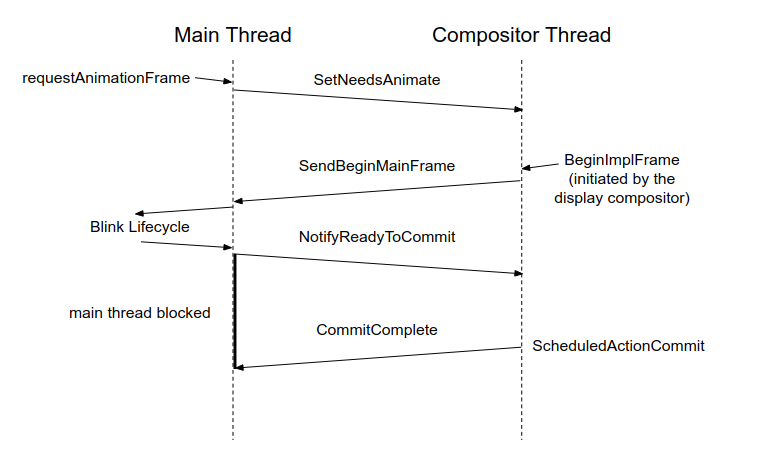
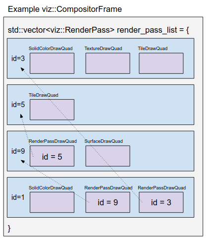

# How cc Works

[Original google doc](https://docs.google.com/document/d/1yjzOWrPfFGviEd1nru3yzqxSHETC-zsEBSt9C8SvV-Q/edit)

[Chinese translation](https://zhuanlan.zhihu.com/p/54601110)

[TOC]

## tl;dr

[cc/](https://cs.chromium.org/chromium/src/cc/) 는 역사적이지만 정확하지 않은 크롬 컴포지터라고 불렸습니다.
그것은 "그" 크롬 컴포지터가 아니고 (물론 많이 존재 하지만), 더 이상 컴포지터도 아닙니다.
danakj 는 "컨텐트 조합자(content collator)" 라는 대안 이름을 제안 했습니다.

cc 는 브라우저 프로세스 안에서 ui/compositor 혹은 안드로이드 코드를 통해, 그리고 유틸리티 프로세스 안에서 ui/compositor 를 통해
임베딩 됩니다.
그것은 Blink / RenderWidget 을 통해서 렌더러 프로세스 안에도 임베딩 됩니다.
cc 는 임베더로부터 페인트 입력(painted inputs) 을 가져와서, 위치를 알아내고 만약 화면에 나타난다면,
페인트 입력으로 부터 gpu 텍스쳐로 이미지를 레스터라이즈 하고, 디코딩하고, 애니매이팅 해서 컴포지터 프레임의 형태로,
텍스쳐들을 디스플레이 컴포지터에 전달 합니다.
cc 는 또한 Blink 를 거치지 않고 브라우저 프로세스로 부터 전달되는 핀치와 스크롤 제스쳐와 같은 입력을 응답성있게 처리 합니다.

## Process / thread architecture

cc 는 단일 쓰레드 혹은 멀티 쓰레드로 임베딩 될 수 있습니다.
단일 쓰레드 버전은 오버헤드가 적습니다.
멀티 쓰레드 버전은 지연 비용이 발생하지만, 입력과 애니매이션이 다른 쓰레드가 바쁘 더라도 하나의 쓰레드에서 응답성 있게 처리될
수 있도록 합니다.
일반적으로, 브라우저는 메인 쓰레드가 비용이 적고 가벼워서 단일 쓰레드로 사용하지만, 렌더러는 (Blink) 메인 쓰레드가 어떤 페이지에서는
아주 바쁘기 때문에 멀티 쓰레드를 사용합니다.

단일 그리고 멀티 쓰레드 버전 모두 [cc::Scheduler](#scheduling) 를 사용하도록 하며, 프레임들을 언제 보낼지 결정 합니다.
한 가지 예외는(오직 한 곳에서만 사용하는 세번째 모드) Blink 레이아웃 테스트와 sim 테스트 이며, (항상) 스케쥴러를 사용하지 않고,
LayerTreeHost::Composite 를 통해서 언제 동기로(synchronously) 컴포지트를 할지 cc 에게 알려줍니다.
이것은 역사적인 이유이며, 또한 테스트 하는 동안 더 많은 제어를 합니다.

## Content Data Flow Overview

임베더가 사용하는 cc 의 주요 인터페이스는 (다양한 LayerTreeSettings 에 의해 생성되는) LayerTreeHost 이며, [레이어들](#layers) 의  [트리](#trees-commit-activation) 입니다.
하나의 레이어는 컨텐트에 해당하는 하나의 사각형이며, 화면에 컨텐트가 어떻게 보여져야 하는지에 대한 다양한 속성을 포함 합니다.
cc 는 컨텐트에 대한 페인트된 표현 (예, PaintRecord) 을 레스터라이즈된 표현 (소프트웨어 비트맵 혹은 gpu 텍스쳐) 으로 변환하고, 화면에 보일 사각형의 위치를 알아냅니다.

cc 는 이 레이어 트리를 PropertyTreeBuilder 를 통해 하나의 프로퍼티 트리(property trees) 집합으로 변환하고, 레이어 트리를 보여지는 레이어들에 대한 순서있는 리스트로 단순화 합니다.
slimming paint 프로젝트의 일부로, Blink 는 훨씬 이전의 레이어 트리 인터페이스를 통하지 않고, 직접 프로퍼티 트리와 레이어 리스트를 설정하며, 파이프라인에서 이 부분의 작업은 피할 것 입니다.

[커밋 프로세스](#commit-flow) 동안, cc 는 모든 메인 쓰레드 자료구조들로 부터의 입력을 컴포지터 쓰레드의 자료구조로들로 전달 합니다.
이 시점에, cc 는 각 레이어의 어떤 영역들이 보여야 하는지 결정하고 이미지 디코드하고 [컨텐트를 레스터](#raster-and-tile-management) 하는 단계를 진행 합니다.

불행하게도 cc 는 아직 여러 곳에서 "draw" 와 "swap" 이라는 용어를 사용하는데, 둘 다 그에 해당하는 일은 하지 않습니다.
cc 에서 "draw" 는 최종적으로 화면에 그려질 쿼드(quads) 와 렌더 패스(render passes) 로 채워진 [컴포지터 프레임](#compositor-frames-render-passes-quads) 을 생성하는 것을 의미 합니다.
cc 에서 "swap" 은 CompositorFrameSink 을 통해 생성한 프레임을 디스플레이 컴포지터(display compositor) 에 제출하는 것을 의미 합니다.
이 프레임들은 SurfaceAggregator 로 보내지는데, 모든 프레임 생성자들로 부터 보내진 컴포지터 프레임들이 모두 모아지는 곳 입니다.

## Input Data Flow Overview

cc 의 다른 주요 입력은 클릭, 마우스 휠, 터치 제스처와 같은 사용자 입력 입니다.
렌더러 프로세스에서, 입력은 브라우저 프로세스로 부터 전달 됩니다. 
그것은 ui::InputHandlerProxy (a cc::InputHandlerClient) 에 의해 처리 됩니다.

이 입력의 일부는 특정 시간마다 LayerTreeHostImpl (a cc::InputHandler) 로 전달 됩니다.
이것은 활동중인 레이어의 속성 트리를 수정하고 필요에 따라 스크롤이나 핀치 할 수 있도록 합니다.
일부 입력은 컴포지터 쓰레드에 의해 처리될 수 없고 (예. 동기로 동작하는 자바스크립트 터치 혹은 휠(wheel) 핸들러), Blink 에서 직접 처리하도록 전달 됩니다.
이 입력 흐름은 이전 절에서의 컨텐트 데이터 경로와 반대로 갑니다.

## Commit Flow

커밋은 메인 쓰레드에서 컴포지터 쓰레드로 데이터를 원자적으로 받는 방법 입니다.
(단일 쓰레드 모드로 실행 하더라도, 이 작업을 수행하여 데이터를 올바른 자료구조로 옮깁니다.) IPC 로 보내기 보단, 메인 쓰레드를 멈추고 데이터를 복사해서 넘김으로써 커밋이 완료 됩니다.

메인 쓰레드는 몇 가지 방법으로 커밋을 요청할 수 있습니다.
대부분 웹페이지는 requestAnimationFrame 를 통해 요청하는데, 결국 LayerTreeHost 의 SetNeedsAnimate 를 호출 합니다.
추가적으로, 어떤 cc 의 입력이든 수정하면 (예. 트랜스폼(transform)과 같은 레이어 속성이나 레이어 컨텐트의 변경) 역시 LayerTreeHost 의 SetNeedsAnimate, SetNeedsUpdate, 혹은 SetNeedsCommit 을 호출 합니다.
다른 SetNeeds 함수들은 필요한 작업이 정해지지 않으면 그 커밋에 대한 다른 수준의 조기 중단을 허용 합니다.
(예를 들면, requestAnimationFrame 의 콜백이 아무일도 안하면, 커밋할 필요가 없거나 레이어를 갱신할 필요가 없습니다.) 이 모든 함수들은 현재 아무것도 하고 있지 않으면, 스케줄러에게 BeginMainFrame 을 요청 합니다.

어떤 시점에서, 스케줄러는 ScheduledActionBeginMainFrame 으로 응합 합니다.
이것은 BeginMainFrame 을 시작하기 위해, 컴포지터 쓰레드로 부터 BeginFrameArgs 을 메인 쓰레드로 보냅니다.
BeginFrameArgs 은 (애니매이션을 위한) 시간과 스크롤 증분(scroll deltas)을 포함하는데, (주로 사용자의 제스쳐를 처리한 결과로써) 컴포지터 쓰레드에는 적용 되었지만 Blink 는 알지 못합니다.
Blink 가 cc 를 임베딩 하고 있을 때, 어떤 컴포지터 스크롤 증분이던 BeginMainFrame 을 Blink 에 적용하고, requestAnimationFrame 로직을 시작하며, Blink [렌더링 생명주기](https://docs.google.com/document/d/1aitSOucL0VHZa9Z2vbRJSyAIsAz24kX8LFByQ5xQnUg/edit#) 의 반을 끝냅니다.

이것이 끝나면, cc 는 모든 레이어를 업데이트 합니다.
이 업데이트 파이프라인에서 어떤 지점이던 cc 가 요구한 작업이 없다고 결정하면(예. 컴포지터 쓰레드 스크롤이 Blink 를 업데이트 하려고 하는데, 그 스크롤에 대해 페이지 변경이 없는 경우), 커밋을 조기에 종료할 것 입니다.
(현재 단일 쓰레드로 동작하는 cc 는 커밋을 결코 중단하지 않습니다.) 임베더가 BeginMainFrame 작업을 끝냈고, 그 커밋이 중단되지 않았다면, ProxyMain 는 NotifyReadyToCommit 를 동기 호출하고 컴포지터 쓰레드에 뮤텍스를 전달하면서 중단(block) 상태가 됩니다.

스케쥴러가 커밋할 준비가 돠면, ScheduledActionCommit 로 응답할 것 입니다.
그때 컴포지터 쓰레드의 ProxyImpl 은 (블럭되어 있는 동안) 메인 쓰레드로 부터의 데이터를 컴포지터 쓰레드 자료구조로 복사하는 모든 작업을
수행 합니다.
그러면 메인 쓰레드가 계속 진행할 수 있도록 뮤텍스를 릴리즈 합니다.

ProxyImpl 은 메인 쓰레드와 컴포지터 쓰레드의 자료구조들을 모두 접근 할 수 있는 유일한 클래스 입니다.
메인 쓰레드가 블럭될 때 메인 쓰레드의 LayerTreeHost 와 레이어들만 접근할 수 있으며, 이것을 접근하는 메서드 안에서 DCHECK 을 통해 강제 합니다.
ProxyMain 은 메인 쓰레드에서 대응되는 것이며 LayerTreeHost 에 의해 소유 됩니다.
단일 쓰레드의 경우, SingleThreadProxy 가 ProxyMain 와 ProxyImpl 둘 모두의 작업을 수행 합니다.

## Layers

A layer is a 2d rectangle of content with integer bounds.
It has some transform, clip, and effects on it that describe how it should look on screen.

There are two separate class hierarchies of Layers, one for the main thread layer tree (deriving from cc::Layer) and one for the compositor thread pending, active, and recycle layer trees (deriving from cc::LayerImpl).
There is roughly a 1:1 correspondence, such that there exists SurfaceLayer and SurfaceLayerImpl or PictureLayer and PictureLayerImpl, so this section will mostly talk about these pairs synonymously.

On the main thread, Layers are refcounted.
LayerTreeHost owns the root layer, and each layer recursively owns its children.
Some other parts of Blink also provide layers (e.g. the media system creating surface or video layers, plugins), which is why this is ref-counted.
On the compositor thread, layers are unique_ptrs, owned by their parents.

### Property Trees

There are two ways of specifying hierarchical properties in cc.
The historical way (and the way that ui/ manages this) is to provide a tree of Layers.
If a parent layer has a transform (e.g. a translation, scale, or perspective), a clip, or an effect (e.g. a blur filter, or a mask, or an opacity) then this applies recursively to its children.
This abstraction has a lot of [corner cases](https://docs.google.com/presentation/d/1V7gCqKR-edNdRDv0bDnJa_uEs6iARAU2h5WhgxHyejQ/edit#slide=id.g1c810b6196_0_68) (fixed position layers, scroll parents, scroll children) as well as not being performant (requires traversing a very large tree and calculating all properties at all steps).

[Property trees](https://docs.google.com/presentation/d/1V7gCqKR-edNdRDv0bDnJa_uEs6iARAU2h5WhgxHyejQ/edit?usp=sharing) are a way around this.
Instead, cc is provided with separate trees of properties: a transform tree, a clip tree, an effect tree.
Each layer then has a node id for which transform, clip, and effect node that the layer is using.
In this way, the update is O(interesting nodes) instead of O(layers).
When there are property trees, there is also no longer a need for a tree of layers, and instead an ordered list of layers can be used.

### PictureLayer

A layer containing painted content.
This content comes in the form of a cc::PaintRecord.
PictureLayer is responsible for figuring out which scale(s) the content should be rastered at.
Each scale is represented by a PictureLayerTiling, which is a sparse 2d regular tiling of the content at a particular scale.

Each tile in this tiling is a cc::Tile, which represents potential content and their [rasterization is organized by the TileManager](#raster-and-tile-management).
If you turn on composited layer borders in the [DevTools rendering settings](https://developer.chrome.com/devtools/docs/rendering-settings), you can see the tile borders.
There are a number of heuristics that determine tile sizes, but for software raster tiles are roughly 256x256 px and for gpu raster tiles are roughly viewport width x one quarter viewport height.

There are a number of heuristics to determine when and how to change rasterization scales.
These aren’t perfect, but change them at your own peril.
🐉🐉🐉

### PictureImageLayer

A subclass of PictureLayer.
This is a special case for composited images in Blink.
If an image gets a composited layer but has no borders or padding (i.e. the painted content is exactly equal to the image) then some work can be saved here.
It "rasters" the image at fixed scales such that scaling this image is performant.
This is really a savings for software raster and in a gpu raster world such layers should never be created.

### TextureLayer

Used for plugins, canvas when it does its own raster, and WebGL.
The "texture" here refers to a reference to a gpu texture, though under software compositing it would be a shared memory bitmap.

### SolidColorLayer

If a layer is known to be merely a solid color, then there is no need to spend raster work or gpu memory on it.
This is an optimization for when a layer’s content is known to be simple.

### VideoLayer

Deprecated as a part of the [surfaces for video project](https://docs.google.com/document/d/1tIWUfys0fH2L7h1uH8r53uIrjQg1Ee15ttTMlE0X2Ow/edit).
Should eventually be deleted.

### SurfaceLayer

A surface layer has a surface id, which refers to some other stream of compositor frames in the system.
This is a way of having an indirection to other compositor frame producers.
See also: [surface documentation](https://www.chromium.org/developers/design-documents/chromium-graphics/surfaces).
For example, Blink embeds references to out of process iframes via SurfaceLayer.

### SolidColorScrollbarLayer

Android scrollbars are "solid color" scrollbar layers.
They are simple boxes that can be drawn on the compositor without creating texture resources for them.
Both solid color and painted scrollbar layers exist so that scrolling on the compositor thread can update the scrollbar responsively without going back to the main thread.
Without this, the page would scroll smoothly but the scrollbar would jump around jankily.

### Painted(Overlay)ScrollbarLayer

Desktop (non-Android) scrollbars are painted scrollbars.
Because theme code is not thread safe, the thumb and track are painted and rastered into bitmaps on the main thread.
Then, those bitmaps are emitted as quads on the compositor thread.
ChromeOS uses PaintedOverlayScrollbarLayer, which is a nine-patch bitmap version.

### HeadsUpDisplayLayer

This layer supports [devtools rendering settings](https://developer.chrome.com/devtools/docs/rendering-settings).
It draws an FPS meter, as well as overlays for paint invalidation or damage.
This layer is special because it must be updated last because its inputs depend on all of the other layers’ damage calculations.

### UIResourceLayer / NinePatchLayer

UIResourceLayer is the software bitmap equivalent of TextureLayer.
It handles uploading bitmaps and recreating them as needed when contexts are lost.
NinePatchLayer is a derived UIResourceLayer class that dices up a UIResource into stretchable pieces.

## Trees: commit / activation

There are four types of layer trees, although there always exists 2-3 at any given time:

* Main thread tree (cc::Layers, main thread, always exists)

* Pending tree (cc::LayerImpl, compositor thread, staging for rasterization, optional)

* Active tree (cc::LayerImpl, compositor thread, staging for drawing, always exists)

* Recycle tree (cc::LayerImpl, compositor thread, mutually exclusive with pending tree)

These are called "trees" as historically they have been trees and they exist in cc/trees/, but they are all lists and not trees (sorry).
The main thread tree of Layers is owned by LayerTreeHost.
The pending, active, and recycle trees of LayerImpls are all LayerTreeImpl instances owned by LayerTreeHostImpl.

Commit is the process of pushing layer trees and properties from the main thread layer list to the pending tree.
Activation is the process of pushing layer trees and properties from the pending tree to the active tree.
During each of these processes, a duplicate layer structure is created (with the same layer ids, layer types, and properties).
Layer ids are used to find the corresponding layer on each tree.
A layer with id 5 on the main thread tree will push to layer id 5 on the pending tree.
That pending layer will push to a layer with id 5 on the active tree.
If that layer doesn’t exist, during the push it will be created. Similarly layers that no longer exist in the source tree are removed from the destination tree.
This is all done via the tree synchronization process.

Because allocation of Layer(Impl)s is expensive and most layer tree structures do not change from frame to frame, once a pending tree activates, it becomes the "recycle tree".
This tree is never used for anything except for a cache of the last pending tree.
This avoids allocation and property pushing work from main thread to pending tree.
This is merely an optimization.

The reason the pending tree exists is that if there are multiple changes to webpage content in a single Javascript callstack (e.g. an html canvas has a line drawn on it, while a div moves, and some background-color changes to blue), these all must be presented to the user atomically.
Commit takes a snapshot of these changes and pushes them to the pending tree, so that Blink can continue to update the main thread tree for a future commit.
After commit, these changes need to be rastered, and all of that rasterization must be complete before any of those new tiles can be presented to the user.
The pending tree is the staging area to wait until all of the asynchronous rasterization work is complete.
While the pending tree is staging all the rasterization work, the active tree can be updated with animations and scrolling to still be responsive to the user.

Single-threaded versions of cc do not have a pending tree and commit directly to the active tree.
(The recycle tree is unused in this mode.)  This is an optimization to avoid extra work and copies.
To work around this, the active tree is unable to be drawn until its tiles are all ready to draw.
However, given that this is a single-threaded version of cc, there are no compositor thread animations or scrolling, and so there is little reason to need to draw.

## Raster and tile management

TileManager is responsible for rasterizing the world of tiles.
Each PictureLayer provides a set of Tiles to rasterize, where each Tile is a subrectangle of painted content at a particular scale.

The TileManager finds all the tiles that are required to draw on the active tree, all the tiles that are required to activate on the pending tree, less important tiles that are close to the viewport but are not visible, and also offscreen images to decode.

There are currently three modes of raster in cc:

* software raster: generate software bitmaps in the raster worker

* gpu raster: generate gpu textures by sending gl commands over the command buffer

* oop raster: generate gpu textures by sending paint commands over the command buffer

The TileManager is instructed to do software vs hardware raster based on whether the [LayerTreeFrameSink](https://docs.google.com/document/d/1tFdX9StXn9do31hddfLuZd0KJ_dBFgtYmxgvGKxd0rY/edit) that it uses to submit compositor frames on has a context provider or not.
It is always in one mode or the other.
Switching modes destroys all resources.
GPU raster is also currently deprecated and will be replaced by OOP (out-of-process) raster in all cases eventually.
A common reason for switching modes is that the gpu process has crashed too much and all of Chrome switches from gpu to software raster and compositing modes.

Once the TileManager decides the set of work to do, it generates a TaskGraph with dependencies and schedules that work across worker threads.
TaskGraphs are not updated dynamically, but instead rescheduled as a whole graph.
Tasks cannot be cancelled once they have started running.
Scheduled tasks that have not yet started are cancelled by submitting another graph that does not include them.

### Image Decoding

Image decoding receives a lot of special care in the TileManager, as they are the most expensive part of raster, especially relative to comparatively speedy gpu raster.
Each decode receives its own dependent task in the task graph.
There is a separate decode cache for software raster vs gpu raster.
The SoftwareImageDecodeCache manages decode, scale, and color correction, whereas the GpuImageDecodeCache also uploads those textures to the gpu process, storing them in [gpu discardable memory](https://docs.google.com/document/d/1LoNv02sntMa7PPK-TZTuMgc3UuWFqKpOdEqtFvcm_QE/edit).

cc also handles all animation of animated gifs in Chrome.
When gifs animate, they generate a new pending tree (initiated by the compositor thread instead of the main thread) with some raster invalidations and then re-raster tiles that are covered by that gif.

### Raster Buffer Providers

Apart from software vs hardware raster modes, Chrome can also run in software vs hardware display compositing modes.
Chrome never mixes software compositing with hardware raster, but the other three combinations of raster mode x compositing mode are valid.

The compositing mode affects the choice of RasterBufferProvider that cc provides, which manages the raster process and resource management on the raster worker threads:

* BitmapRasterBufferProvider: rasters software bitmaps for software compositing

* OneCopyRasterBufferProvider: rasters software bitmaps for gpu compositing into shared memory, which are then uploaded in the gpu process

* ZeroCopyRasterBufferProvider: rasters software bitmaps for gpu compositing directly into a GpuMemoryBuffer (e.g. IOSurface), which can immediately be used by the display compositor

* GpuRasterBufferProvider: rasters gpu textures for gpu compositing over a command buffer via gl (for gpu raster) or via paint commands (for oop raster)

Note, due to locks on the context, gpu and oop raster are limited to one worker thread at a time, although image decoding can proceed in parallel on other threads.
This single thread limitation is solved with a lock and not with thread affinity.

## Animation

This directory implements an animation framework (used by LayerTreeHost(Impl) through the cc::MutatorHost interface). The framework supports keyframe based animations of transform lists, opacity, and filter lists which directly manipulate those values on the relevant TransformNode / EffectNode in the property tree (identified by ElementId).

An animation is represented by an instance of Animation which has one (or more in the future) KeyframeEffects, each of which has multiple KeyframeModels. Animation manages the play state, start time, etc of an animation, KeyframeEffect represents a target element of the animation, and each KeyframeModel describes the animation of a particular property (e.g. transform / opacity / filter) on that element. An animation may either represent an embedder animation (e.g., a Blink animation of a transform property) or it can be an animation from cc itself (e.g., a scroll animation for smooth scrolling).

LayerTreeHostImpl informs AnimationHost of new and removed elements, which in turn will update the state of animations which depend on those elements. It calls NeedsTickAnimations to know if more animation frames should be scheduled, and TickAnimations every frame to update animation timing, state, generate animation events, and update the actual output value of property tree nodes based on the animation.

## cc/paint/

This directory stores a number of classes that represent painted content.
They are extremely similar to Skia data structures, but are mutable, introspectable, and serializable in all cases.
They also handle security concerns (e.g. [TOCTOU](https://en.wikipedia.org/wiki/Time_of_check_to_time_of_use) issues serializing out of shared memory that a malicious renderer could be manipulating as it is read by the gpu process) that Skia does not want to think about.

PaintRecord (aka PaintOpBuffer) is the SkPicture equivalent that stores a number of PaintOps.
A PaintRecord can either be rasterized by a raster buffer provider into a bitmap or a gpu texture (when using software or gpu raster), or it can be serialized (when using oop raster).

PaintCanvas is the abstract class to record paint commands.
It can be backed by either a SkiaPaintCanvas (to go from paint ops to SkCanvas) or a PaintRecordCanvas (to turn paint ops into a recorded PaintRecord).

## Scheduling

cc’s actions are driven by a cc::Scheduler.
This is one of many schedulers in Chrome, including the Blink scheduler, the viz::DisplayScheduler, the browser UI task scheduler, and the gpu scheduler.

The cc::Scheduler is owned by ProxyImpl (or SingleThreadProxy).
It takes various inputs (visibility, begin frame messages, needs redraw, ready to draw, ready to activate, etc).
These inputs drive the cc::SchedulerStateMachine, which then determines actions for the SchedulerClient (LayerTreeHostImpl) to take, such as "Commit" or “ActivateSyncTree” or “PrepareTiles”.
These actions are generally expensive parts of the pipeline that we want to carefully rate limit or that have state-related dependencies.

cc::Scheduler code differentiates begin frames from the display compositor as BeginImplFrame (i.e. should cc produce a compositor frame) and a begin frame for its embedder as BeginMainFrame (i.e. should cc tell Blink to run requestAnimationFrame and produce a commit, or in the browser if should cc tell ui to do something similar).
The BeginImplFrame is driven by a viz::BeginFrameSource which in turn is driven the the display compositor.

In a full pipeline update with low latency and fast rasterization, the general scheduling flow is BeginImplFrame -> BeginMainFrame -> Commit -> ReadyToActivate -> Activate -> ReadyToDraw -> Draw.

Additionally, if rasterization is slow, a second BeginMainFrame can be sent before activation, and it will block in NotifyReadyToCommit until the activation completes, as the SchedulingStateMachine will prevent the commit from starting while there is a pending tree that hasn’t activated yet.
This allows the main thread to work on the next frame in parallel instead of sitting idle at the expense of latency.
One hypothetical ordering of events with slow raster could be:

BeginImplFrame1 -> BeginMainFrame1 -> Commit1 -> (slow raster) -> BeginImplFrame2 -> BeginMainFrame2 -> ReadyToActivate1 -> Activate1 -> Commit2 -> ReadyToDraw1 -> Draw1.

The cc::Scheduler maintains a deadline by which it expects its embedder to respond.
If the main thread is slow to respond, then the Scheduler may draw without waiting for a commit.
If this happens, then Scheduler is considered to be in high latency mode.
If future frames start becoming faster again, the scheduler can attempt to skip a BeginMainFrame in order to "catch up" and re-enter low latency mode.
High latency mode trades off latency for throughput by increasing pipelining.
It maintains this distinction by keeping a history of times and trying to adjust with heuristics.

## Compositor frames, render passes, quads

The output of cc is a compositor frame.
A compositor frame consists of metadata (device scale, color space, size) and an ordered set of render passes.
A render pass contains an ordered set of quads that have references to resources (e.g. gpu textures) and information about how to draw those resources (sizes, scales, texture coordinates, etc).
A quad is a single rectangle on screen, and is what you see when [composited layer borders are visualized](https://developer.chrome.com/devtools/docs/rendering-settings#show-composited%20layer%20borders).
Layers themselves produce quads via derived AppendQuads function.
This produces a set of quads that fill (without overlapping or intersecting) the visible rect of the layer.

There are various types of quads that roughly correspond to different layer types (ContentDrawQuad, TextureDrawQuad, SolidColorDrawQuad).
Because layers that produce many quads (i.e. PictureLayerImpl) produce many quads with the same info, SharedQuadState is an optimization that collects this shared information so that each individual quad is slimmer.
RenderSurfaceImpls are 1:1 with render passes and exist mostly to provide the same AppendQuads logic that Layers do for their quads, in that RenderSurfaceImpl produces RenderPassDrawQuads.

A render pass exists to support composited effects (see: effect tree).
These can be cases where compositing is required to perform an effect.
It can also be cases where doing compositing first can make the effect easier to implement (because then it applies to a single render pass texture, instead of an arbitrary set of quads produced by some subtree of layers).
Common cases for render passes are: masks, filters (e.g. blur), clipping rotated layers, or opacity applied to a subtree of content.

Inside a compositor frame, render passes and the quads within a render pass are ordered.
The render passes are a flattened list that represent that dependency tree of render passes.
If render pass 1 depends on render pass 9 (because it contains a RenderPassDrawQuad referencing the output of 9), then 9 will appear in the list before 1.
Therefore, the root render pass is always last in the list.
Inside a single render pass, the quads are ordered back to front ([Painter’s algorithm](https://en.wikipedia.org/wiki/Painter%27s_algorithm)).

In general, quads are not considered to live in a 3d space (even if transformed by 3d transforms) and are still drawn in order, on top of anything drawn before it.
However, there is a mode where a set of quads can be in a 3d context (caused by css transform-style: preserve-3d).
A BSP tree is used to sort and intersect these against each other in the same 3d context.

## Glossary

See: [cc/README.md](https://chromium.googlesource.com/chromium/src/+/master/cc/README.md#glossaries)

## Other Resources

For a list of presentations, videos, and design docs, see: [https://www.chromium.org/developers/design-documents/chromium-graphics](https://www.chromium.org/developers/design-documents/chromium-graphics)

## Miscellaneous Corner Cases That Don’t Fit Anywhere Else, Sorry

### Damage

Chrome has different notions of invalidation throughout the system.
"Paint invalidation" is portions of the document that need to be repainted in Blink.
“Raster invalidation” is parts of a layer that have changed and need to be re-rastered (possibly due to paint invalidation, but also synthetic invalidations such as the first time a layer is rastered or when textures are thrown away and then needed again).
Finally, damage is another word for “draw invalidation”.
It’s the part of the screen that needs to be redrawn.

There’s two types of damage: invalidation damage and expose damage.
Invalidation damage is due to raster invalidation, where a part of a texture has changed and the screen needs to be updated.
Expose damage is when a layer goes away, gets added for the first time, or gets reordered.
There’s no raster invalidation in these cases, but the screen still needs to be updated.

cc calculates damage in the DamageTracker and forwards it along with a CompositorFrame.
One reason damage is needed in the display compositor is to do partial swap (where only a portion of the screen is updated), which saves power.
Another reason is when using hardware overlays, such that the display compositor can know that only an overlay was damaged and not have to re-composite the rest of the scene.

### Mask Layers

Mask layers are layers used to implement a [masking effect](https://webkit.org/blog/181/css-masks/).
They sit outside the layer tree, without parents.
They’re owned by the layer the mask is applied to.
They can be any type of layer subclass (e.g. PictureLayer or SolidColorLayer).
Any time layers are iterated over, they are a special case that needs to be considered because they aren’t part of the normal parent/child tree.
They get treated the same as other layers in terms of rasterization and tile management, although their AppendQuads function goes through RenderSurfaceImpl instead of in the top level iteration, because they are part of an effect and not a layer drawn on its own.

### "Impl"

cc uses the "impl" suffix ...differently than the rest of Chrome or other software engineers.
In cc, “impl” means that the class is used on the compositor thread and not on the main thread.

The historical reason for this is that at one point we had Layer on the main thread and we needed an equivalent class to run on the compositor thread.
jamesr@ consulted with nduca@ who made the very logical argument that things on the compositor thread were internal to the compositor and would really be the implementation of the main thread version, and hence LayerImpl.
See: [https://bugs.webkit.org/show\_bug.cgi?id=55013#c5](https://bugs.webkit.org/show_bug.cgi?id=55013#c5)

Then if you need a tree of LayerImpls, you have LayerTreeImpl, and a place to hang those trees is LayerTreeHostImpl.
Suddenly, then the "impl thread" was the thread where all the “impl classes” lived.
If you’re moving rasterization to the compositor thread, then suddenly that’s called “impl-side painting”.
